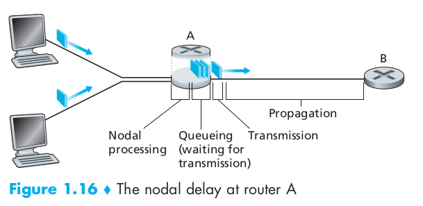
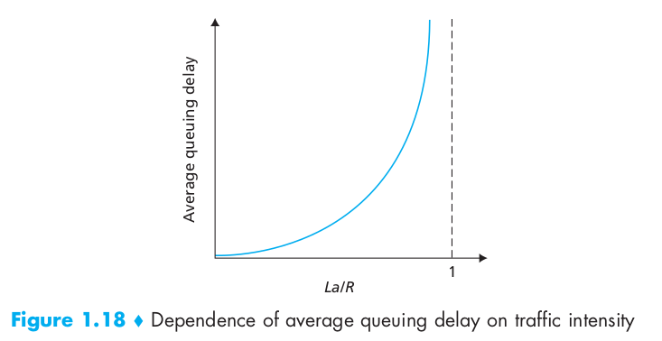
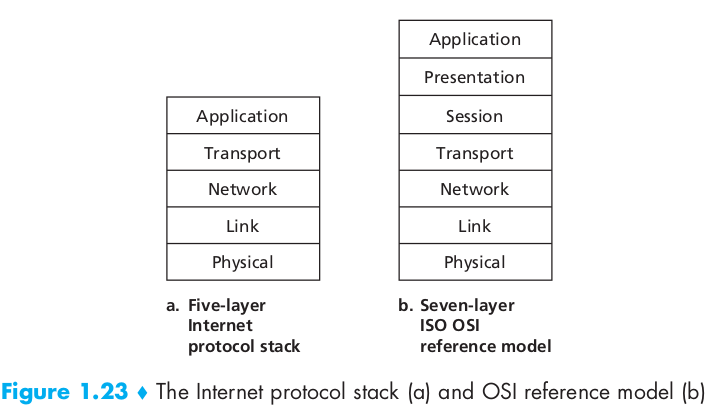
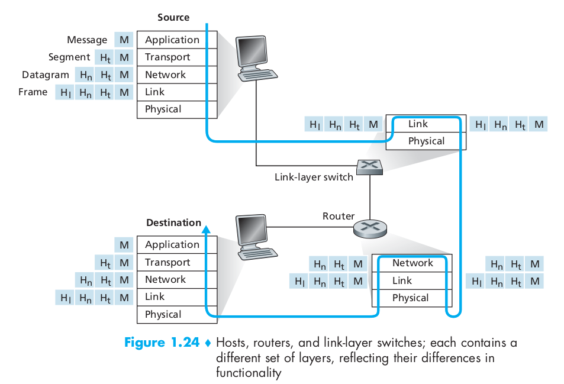

<!--ts-->
   * [第一章：计算机网络和因特网](#第一章计算机网络和因特网)
      * [1.1 什么是因特网](#11-什么是因特网)
         * [1.1.1 具体构成描述](#111-具体构成描述)
         * [1.1.2 服务描述](#112-服务描述)
         * [1.1.3 什么是协议](#113-什么是协议)
      * [1.2 网络边缘](#12-网络边缘)
         * [1.2.1 接入网](#121-接入网)
            * [1.家庭接入](#1家庭接入)
            * [2. 企业（和家庭）接入：以太网和WIFI](#2-企业和家庭接入以太网和wifi)
            * [3. 广域无线接入：3g和LTE](#3-广域无线接入3g和lte)
         * [1.2.2 物理媒体](#122-物理媒体)
      * [1.3 网络核心](#13-网络核心)
         * [1.3.1 分组交换](#131-分组交换)
            * [1. 存储转发传输](#1-存储转发传输)
            * [2. 排队时延和分组丢失](#2-排队时延和分组丢失)
            * [3. 转发表和路由选择协议](#3-转发表和路由选择协议)
         * [1.3.2 电路交换](#132-电路交换)
            * [1. 电路交换网络中的复用](#1-电路交换网络中的复用)
            * [2. 分组交换与电路交换的对比](#2-分组交换与电路交换的对比)
         * [1.3.3 网络的网络](#133-网络的网络)
            * [1. 网络结构 1](#1-网络结构-1)
            * [2. 网络结构 2](#2-网络结构-2)
            * [3. 网络结构 3](#3-网络结构-3)
      * [1.4 分组交换网络中的时延、丢包和吞吐量](#14-分组交换网络中的时延丢包和吞吐量)
         * [1.4.1 分组交换网中的时延概述](#141-分组交换网中的时延概述)
            * [1.处理时延：](#1处理时延)
            * [2. 排队时延：](#2-排队时延)
            * [3. 传输（发射）时延：](#3-传输发射时延)
            * [4.传播时延：](#4传播时延)
            * [5.传输时延和传播时延比较：](#5传输时延和传播时延比较)
         * [1.4.2 排队时延和丢包](#142-排队时延和丢包)
         * [1.4.3 端到端时延](#143-端到端时延)
         * [1.4.4 计算机网络中的吞吐量](#144-计算机网络中的吞吐量)
      * [1.5 协议层次及其服务模型](#15-协议层次及其服务模型)
         * [1.5.1 分层的体系结构](#151-分层的体系结构)
            * [1. 协议分层：](#1-协议分层)
            * [OSI模型](#osi模型)
         * [1.5.2 封装](#152-封装)

<!-- Added by: jing, at: 2018-08-26T14:46+08:00 -->

<!--te-->

# 第一章：计算机网络和因特网

## 1.1 什么是因特网

### 1.1.1 具体构成描述

* **端系统** 通过 **通信链路** 和 **分组交换机** 连接到一起。
* 链路的 **传输速率** 以比特/秒（bit/s，或bps）度量。
* 当一台端系统向另一端系统发送数据时，发送端系统将数据分段，并为每段加上首部字节。由此形成的信息包称为 **分组**。
* 分组交换机两种最著名的类型是
  1. 路由器
  2. 链路层交换机
* **因特网服务提供商**：Internet Service Provider, ISP
* **传输控制协议**：Transmission Control Protocol,TCP
* **网际协议**：Internet Protocol， IP， 定义了在路由器和端系统之间发送和接收的分组格式

### 1.1.2 服务描述

### 1.1.3 什么是协议

## 1.2 网络边缘

### 1.2.1 接入网

#### 1.家庭接入

* **DSL**：Digital Subscriber Line, 本地电话公司是ISP

  DSL调制解调器与位于电话公司的本地中心局（CO）中的数字用户线接入复用器（DSLAM）交换数据。家庭的DSL调制解调器得到数字数据后将其转换为高频音，以通过电话线传输给本地中心局；模拟信号在DSLAM处转换回数字形式。

  

* 电缆：cable Internet access, 有线电视公司是ISP

  电缆因特网接入需要 **电缆调制解调器** (cable modem)，在电缆头端，**电缆调制解调器** （CMTS）与DSLAM具有相似功能，即将下行家庭中的电缆调制解调器发送的模拟信号转换回数字形式。

* 光纤到户：Fiber To The Home, FTTH，从本地中心局直接到每户设置一根光纤，实际一根光纤由许多家庭共享。分配方式有 **主动光纤网络**（Active Optical Network, AON) 和 **被动光纤网络**（Passive Optical Network, PON）。

  PON：每个家庭具有一个 **光纤网络端接器**（Optical Network Terminator, ONT），连接到附近的分配器（splitter），中心局中的 **光纤线路端接器** 提供光信号和电信号之间的转换。

  

#### 2. 企业（和家庭）接入：以太网和WIFI

#### 3. 广域无线接入：3g和LTE

### 1.2.2 物理媒体

* **导引型媒体**（guided media）
  1. 双绞铜线
  2. 同轴电缆
  3. 光纤

* **非导引型媒体**（unguided media）
  1. 陆地无线电信道
  2. 卫星无线电信道

## 1.3 网络核心

### 1.3.1 分组交换

* 源端系统向目的端系统发送报文，会将长报文划分为较小的数据块，称之为 **分组**

* 在源和目的地之间，每个分组都通过 **通信链路** 和 **分组交换机** （主要有两类：**路由器**和**链路层交换机**）传送。
* 分组以等于该链路 **最大** 传输速率的速度在通信链路上传输

#### 1. 存储转发传输

在交换机能够开始向输出链路传输该分组的第一个比特之前，必须接收到整个分组

#### 2. 排队时延和分组丢失

* 对于每条相连的链路，该分组交换机有一个 **输出缓存**（output buffer，也称为 **输出队列**（output queue））。如果到达的分组传输到某条链路，但是该链路正在传输其他分组，则该分组必须在输出缓存中等待。因此除了 **存储转发时延** 以外，分组还要承受输出缓存的 **排队时延**。
* 如果一个分组到达时，输出缓存已满，则该分组或已经排队的分组之一将被丢弃，此为 **丢包。**

#### 3. 转发表和路由选择协议

* 每台路由器具有一个 **转发表** ，用于将目的地址（或目的地址的一部分）映射成为输出链路。
* **路由选择协议**（routing protocol）用于自动设置转发表。

### 1.3.2 电路交换

* 网络链路和交换机移动数据的两个基本方法：**电路交换**（circuit switching），**分组交换**（packet switching）。
* **电路交换**中，在端系统通信会话期间，预留了端系统间沿路径通信所需要的资源（缓存、链路传输率）。而在 **分组交换** 中是不预留的。
* 传统电话网络就是电路交换的一个例子，在发送方和接收方建立连接时，该路径上所有的交换机都将为该连接维护连接状态，该连接称为 **电路**（circuit）

#### 1. 电路交换网络中的复用

* 链路中的电路是通过 **频分复用**（Frequency-Division Multiplexing, FDM）和 **时分复用**（Time-Division Multiplexing, TDM） 实现的。

* FDM：连接期间链路为每条连接专用一个频段，频段宽度称为 **带宽**（band-width）。调频无线电台就是使用FDM来共享88MHz~108MHz。
* TDM：时间被划分为固定期间的 **帧**(frame)，每个帧又被划分为固定数量的 **时隙**(slot)。当网络跨越一条链路创建一个连接时，网络在每个帧中为该连接指定一个时隙专门由该连接单独使用。

#### 2. 分组交换与电路交换的对比

分组交换性能能够优于电路交换的性能，发展趋势也是向着分组交换。

### 1.3.3 网络的网络

#### 1. 网络结构 1

假想用单一 **全球传输ISP**（提供商， provider）互联所有 **接入ISP**（客户，customer）

#### 2. 网络结构 2

由数十万接入ISP和多个全球传输ISP组成，多个全球传输ISP必须是互联的。

#### 3. 网络结构 3

第一层不仅有多个竞争ISP，在一个区域也可能有多个竞争ISP，比如中国，每个城市有接入ISP，他们与省级ISP连接，省级ISP又与国家级ISP连接，国家级ISP最终与第一层ISP连接。

## 1.4 分组交换网络中的时延、丢包和吞吐量

**吞吐量**：每秒钟能够传送的数据量

### 1.4.1 分组交换网中的时延概述

#### 1.处理时延 

检查分组首部和决定该分组导向何处所需要的时间是其一部分，也包括其他因素，比如检查比特级别的差错所需要的时间。

#### 2. 排队时延

一个特定的分组的排队时延长度将取决于先期到达的正在排队等待向链路传输的分组数量。

#### 3. 传输（发射）时延

L比特表示分组长度，R bps表示从路由器A到路由器B的链路传输速率。则传输时延是 L/R。

#### 4.传播时延

两台路由器之间的距离除以传播速率 (d/s)

#### 5.传输时延和传播时延比较

传输时延是路由器推出分组所需要的时间，是分组长度和链路传输速率的函数，与两台路由器距离无关。传播时延是一个比特从一台路由器传播到另一台路由器所需的时间，是两台路由器间距离的函数，与分组长度和链路传输速率无关。

### 1.4.2 排队时延和丢包

* 令 a 表示分组到达队列的平均速率（分组/秒）。R 是传输速率（bps）。每个分组由 L 比特组成。则 La/R 被称为 **流量强度**（traffic intensity）。流量强度不能大于1，否则排队时延趋于无限大。

* 随着流量强度接近于1，排队时延并不是真正趋向无穷大，相反，到达的分组将发现一个满的队列，由于没地方储存这个分组，路由器将丢弃（drop）该分组，该分组会丢失（lost）。

### 1.4.3 端到端时延

dend-end = N(dproc + dtrans + dprop)

### 1.4.4 计算机网络中的吞吐量

主机A到主机B跨越计算机网络传送一个大文件。

* 任何时间瞬间的 **瞬时吞吐量** 是主机B接收到文件的速率（bps计）

* 如果文件由F比特组成，主机B接收到所有F比特用去T秒，则文件传送的 **平均吞吐量** 是F/T bps。

* 对于简单的两链路网络，其吞吐量是min{Rc, Rs}，它是 **瓶颈链路**。

  

  对应图 b. 文件传输吞吐量是{R1, R2, ... , RN}。

* 吞吐量取决于数据流过的链路的传输速率还有干扰流量。

## 1.5 协议层次及其服务模型

### 1.5.1 分层的体系结构

#### 1. 协议分层

各层的所有协议被称为协议栈（protocol stack），因特网的协议栈由5各层次组成：物理层、链路层、网络层、运输层、应用层。

(1) 应用层

* 应用层是网络应用程序及它们的应用层协议存留的地方。协议比如有 **HTTP**（提供了Web文档的请求和传送）、**SMTP**（提供了电子邮件报文的传输）和 **FTP**（提供两个端系统之间的文件传送）。**DNS** 域名系统。

* 位于应用层的信息分组称为 **报文**。

(2) 运输层

* 因特网的运输层在应用程序端点之间传送应用层报文。
* 两种运输协议，**TCP** 和 **UDP** 。
* **TCP**：向应用程序提供面向连接的服务。包括应用层报文向目的地的确保传递和流量控制（发送方/接收方速率匹配）。TCP 也将长报文划分为短报文，并提供拥塞控制机制，网络拥塞时，源会抑制其传输速率。
* **UDP**：向应用程序提供无连接服务。这是一种不提供不必要服务的服务，没有可靠性，没有流量控制，也没有拥塞控制。
* 运输层的分组称为 **报文段**。

(3) 网络层

* 网络层负责将称为 **数据报**（datagram）的网络层分组从一台主机移动到另一台主机。源主机中的运输层协议（TCP UDP）向网络层递交运输层**报文段**和**目的地址**
* 包含 **网际协议IP**，定义了在数据报中的各个字段以及端系统和路由器如何作用于这些字段。
* 包含 **路由选择协议** 根据该路由将数据报从源传输到目的地。

(4) 链路层

* 网络层将数据报下传给链路层，链路层沿着路径将数报传递给下一个级节点，在下一个节点，链路层将数据报上传给网络层。

* 链路层分组称为 **帧**（frame）

(5) 物理层

物理层任务是将该帧中的一个个比特从一个节点移动到下一个节点。

#### OSI模型

7层：应用层、表示层、会话层、运输层、网络层、链路层、物理层。

### 1.5.2 封装

