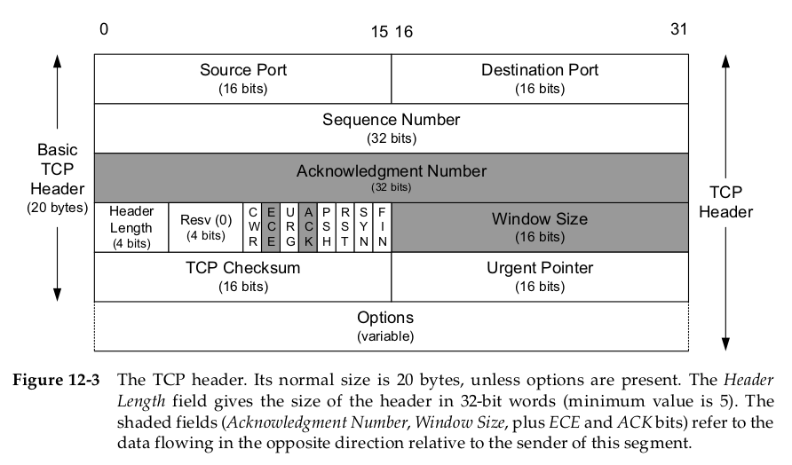

# TCP笔记

## TCP头部结构

基础的TCP头部长度以32位字为单位，共20Bytes
* 客户端端口和服务端端口(16bits * 2)
* 序列号(32bits) 
  TCP为每个字节赋予一个序列号，一个TCP头中的序列号标识着该报文段中数据的第一个字节。
* ACK号(32bits)
  最后被成功接收到的数据字节的序列号+1。
  tip:发送一个ACK与发送任何一个TCP报文段的开销是一样的，因为ACK号字段和ACK位字段都是头部的一部分。
* 头部长度(4bits)
  因为TCP头部有可选项，所以长度是不确定的，需要该字段注明头部长度。以32位字为单位，所以四位表示范围0～60Bytes，也就是TCP头部被限制在60Bytes，而基础不含选项的头部为20Bytes。
* 保留字段(4bits)
* 标志位(8bits)
  * CWR 拥塞窗口减 (发送方降低它的发送速率)
  * ECE ECN回显 (发送方接收到了一个个更早的拥塞通告)
  * URG 紧急 (紧急指针字段有效)，此标志位很少被使用。
  * ACK 确认 (确认号字段有效)，TCP连接建立一般都是启用状态。
  * PSH 推送 (告知接收方应该尽快将数据推送给应用程序)
  * RST 重置连接 (遇到错误，连接取消)
  * SYN 初始化连接的同步序列号。
  * FIN 发送方告知接收方已经结束发送数据，要关闭连接。