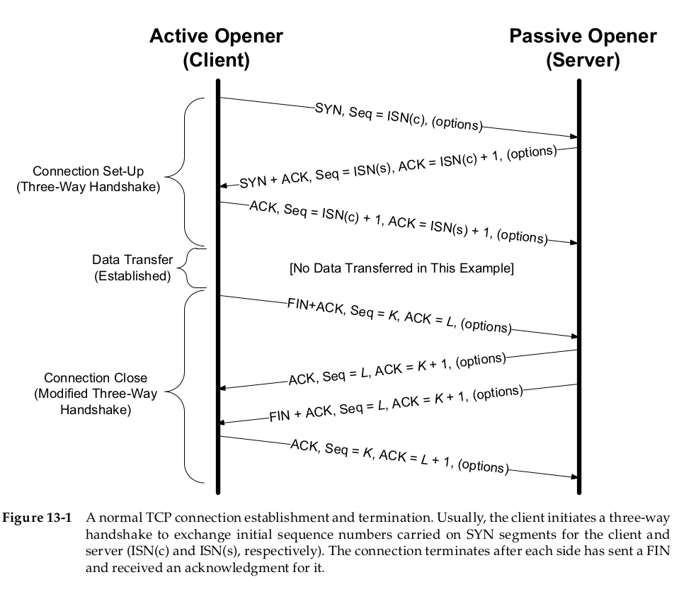
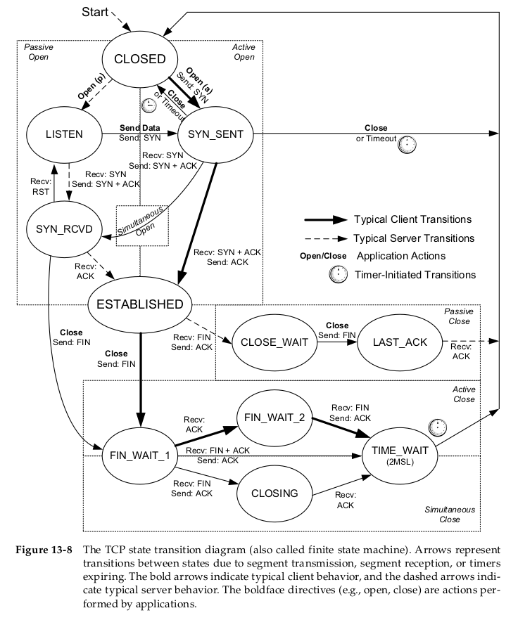
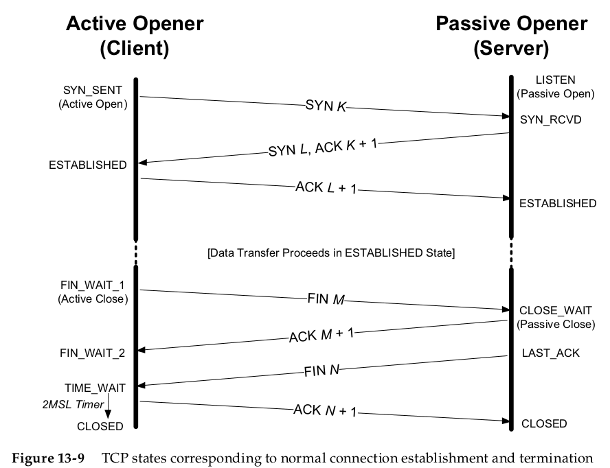

# 传输层

## TCP头部结构

基础的TCP头部长度以32位字为单位，共20Bytes
* 客户端端口和服务端端口(16bits * 2)
* 序列号(32bits) 
  TCP为每个字节赋予一个序列号，一个TCP头中的序列号标识着该报文段中数据的第一个字节。
* ACK号(32bits)
  最后被成功接收到的数据字节的序列号+1。
  tip:发送一个ACK与发送任何一个TCP报文段的开销是一样的，因为ACK号字段和ACK位字段都是头部的一部分。
* 头部长度(4bits)
  因为TCP头部有可选项，所以长度是不确定的，需要该字段注明头部长度。以32位字为单位，所以四位表示范围0～60Bytes，也就是TCP头部被限制在60Bytes，而基础不含选项的头部为20Bytes。
* 保留字段(4bits)
* 标志位(8bits)
  * CWR 拥塞窗口减 (发送方降低它的发送速率)
  * ECE ECN回显 (发送方接收到了一个个更早的拥塞通告)
  * URG 紧急 (紧急指针字段有效)，此标志位很少被使用。
  * ACK 确认 (确认号字段有效)，TCP连接建立一般都是启用状态。
  * PSH 推送 (告知接收方应该尽快将数据推送给应用程序)
  * RST 重置连接 (遇到错误，连接取消)
  * SYN 初始化连接的同步序列号。
  * FIN 发送方告知接收方已经结束发送数据，要关闭连接。
* 窗口大小(16bits)
  告知想接受的数据大小，以Bytes为单位，16bits限制了数据大小在65535Bytes。
* 校验和(16bits)
  发送方计算和保存，接收方验证
* 紧急指针(16bits)
  让发送方给另一端提供特殊标志数据
* 选项字段(最大40Bytes)
## TCP连接的建立和关闭

* TCP连接的建立（三次握手）
  1. 主动开启者（通常为客户端）向被动开启者发送一个SYN，并且附上初始序列号ISN(c)。
  2. 被动开启者收到后也发送一个SYN，并且附上ACK，ACK号为ISN(c)+1，还附上了被动开启者的初始序列号ISN(s)。
  3. 主动开启者收到SYN后，返回一个ACK，序列号为ISN(c)+1，ACK号为ISN(s) + 1;
   
   （以上的报文段中都可带选项）
   **注意**：初始序列号可视为一个32位计数器，每4微秒加1，防止与其他连接序列号重叠。
   **为什么需要三次握手？**

* TCP连接的关闭（四次挥手）
  1. 主动关闭者发送一个FIN报文段，其中还有一个序列号K，一个ACK（ACK号为L）用来确认最近一次收到的数据。
  2. 被动关闭者收到FIN段后，回复一个ACK，序列号为L，ACK号为K+1
  3. 被动关闭者接着发送一个FIN段，序列号为L，ACK号为K+1
  4. 主动关闭者收到后回复一个ACK，序列号为K，ACK号为L+1

  （以上的报文段中都可带选项）   
  **为什么需要四次挥手？**
## TCP状态转换
  

建立连接：
* TCP初始化时状态为`CLOSED`, 如果是主动打开方会快速发送一个SYN转换为`SYN_SENT`状态，如果是被动打开方，会快速转换为`LISTEN`状态。
* `LISTEN`状态收到SYN后，返回一个SYN+ACK，进入`SYN_RCVD`状态。
* `SYN_SENT`状态收到SYN_ACK，发送一个ACK，进入`ESTABLISHED`状态。
* `SYN_RCVD`状态收到ACK，进入`ESTABLISHED`状态。

同时建立连接：
* 两方同时发送SYN，由`CLOSED`状态进入`SYN_SENT`状态。
* 两方接收到SYN后发送SYN+ACK，由`SYN_SENT`状态进入`SYN_RCVD`状态。
* 两方接收到SYN+ACK，发送ACK，`SYN_RCVD`进入`ESTABLISHED`状态。

关闭连接：

* 主动关闭方和被动关闭方都从`ESTABLISHED`状态开始。
* 主动关闭方发送一个FIN，`ESTABLISHED`->`FIN_WAIT_1`
* 被动关闭方收到FIN，回复一个此FIN的ACK，`ESTABLISHED`->`CLOSE_WAIT`
* 主动关闭方收到ACK，`FIN_WAIT_1`->`FIN_WAIT_2`
* 被动关闭方发送一个FIN，`CLOSE_WAIT`->`LAST_ACK`
* 主动关闭方收到FIN，回复一个此FIN的ACK，`FIN_WAIT_2`->`TIME_WAIT`
* 被动关闭方收到ACK，`LAST_ACK`->`CLOSED`
  
同时关闭：
* 主动关闭方和被动关闭方都从`ESTABLISHED`状态开始。
* 双方都发送一个FIN，`ESTABLISHED`->`FIN_WAIT_1`
* 都收到FIN，回复此FIN的ACK，`FIN_WAIT_1`->`CLOSING`
  都收到ACK，`CLOSING`->'`TIME_WAIT`

**TIME_WAIT的作用**
1. 在TCP主动关闭方发送最后一个ACK时会进入`TIME_WAIT`而不是直接进入`CLOSED`，`TIME_WAIT`状态会保持2msl(2 maximun segment lifetime)的时长，一个msl是IP数据报在被接收前能够在网络中存活的最大时间。之所以要2msl的时间是考虑到：最后一个ACK丢失，被动方重传FIN，希望能收到ACK，这个过程完成的时间在极端情况下就是2msl
**注意**：`TIME_WAIT`只是尽可能保证TCP全双工连接的终止，因为被动方重传的FIN也可能丢失，导致2msl过了被动方也没能收到此FIN的ACK
2. TCP的一条连接由一个四元组(src_ip, src port, dst_ip, dst_port)标识，当处于`TIME_WAIT`时，此条连接会被定义为不可使用，这样就避免了一条连接关闭后能立即生成同一条连接，接收到上一次连接的分组。

**避免TIME_WAIT**
`SO_REUSEADDR`这个套接字选项允许分配处于`TIME_WAIT`的端口来建立TCP连接。这一点违背了TCP的最初规范，但是只要能保证不会收到上一条连接分组的干扰，就可以使用。